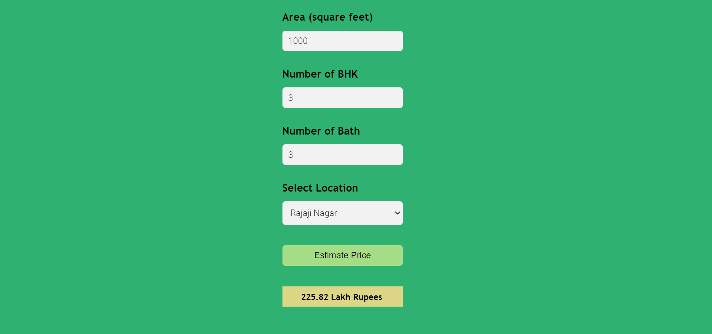

# Banglore-House-Price-Prediction

This project involves using machine learning techniques to build a regression model and apply it to a real-world problem. The model was implemented using various concepts in data science and machine learning. In addition, a web server was developed using the Flask framework to handle requests from a user interface. The project also included deploying the model to a production environment using AWS EC2 and nginx, but due to issues with the AWS subscription the cloud deployment couldn't be completed.

## Dataset
The project was completed using the [Bengaluru House Price Data](https://www.kaggle.com/datasets/amitabhajoy/bengaluru-house-price-data) dataset.

## Concepts Used
* Data Load and Cleaning
* Outlier Detection and Removal
* Feature Engineering
* Dimensionality Reduction
* Hyperparameter Tuning
* K-fold Cross Validation etc.

## Technology Used
* Model was built using *Scikit-Learn* and *Linear Regression*
* Performed Data Cleaning using *Numpy* and *Pandas*
* Used *Matplotlib* for Data Visualization
* Applied *GridSearchCV* for Hyperparameter Tuning
* Wrote a *Python Flask Server* to handle HTTP requests
* Developed User Interface (UI) using *HTML, CSS, and Javascript*
